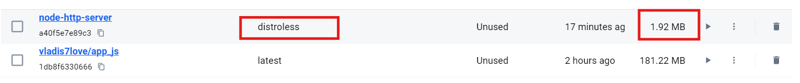

# Countdown Timer Web Application

## Overview

This web application is a simple countdown timer built using HTML, CSS, and JavaScript. It allows users to set a custom time, start the countdown, and alerts the user when the timer ends.

## Features

- Set a custom time using minutes and seconds input.
- Displays the countdown in a clean and readable format.
- Alerts when the timer reaches zero.
- Reset functionality to clear the countdown.

## Frameworks and Technologies

- **Flask Framework:** A lightweight and easy-to-use Python framework for building web applications.
- **Docker:** For containerizing the application to ensure a consistent and portable runtime environment.

## Running Locally

1. Clone the repository `git clone https://github.com/vladislav77777/S25-core-course-labs`.
2. Navigate to the `app_javascript` folder.
3. Open `index.html` in any web browser to use the application.

## Running with Docker

   ```bash
    docker build -t app_js .
    docker run -p 8080:8080 app_js
   ```

Alternatively, you can pull the Docker image from my [Dockerhub repository](https://hub.docker.com/r/vladis7love/app_js) using the following commands:

   ```bash
   docker login
   docker pull vladis7love/app_js:latest
   docker run -p 8080:8080 vladis7love/app_js
   ```

Now, open your browser and go to <http://localhost:8080> to view the countdown timer application.

## Distroless Images

Distroless images are minimal Docker images designed for production environments. Unlike traditional images, they exclude package managers, shells, and other development utilities, providing a smaller attack surface and improved security.

### Differences Between Distroless Images and Previous Images

#### 1. **Minimal Size**

- Contains only the runtime environment and the application dependencies without package managers, shells, and debugging tools.

#### 2. **Improved Security**

- No package manager or shell reduces the attack surface, making it harder for attackers to exploit vulnerabilities.

#### 3. **Non-Root by Default**

- Supports `nonroot` tags to run containers without root privileges, enhancing security.

#### 4. **Single Responsibility**

- Focused solely on running the application efficiently.

### Size Comparison



### Running

```bash
    docker build -t app_js:distroless -f Distroless.Dockerfile .
    docker run -p 8080:8080 app_js:distroless
   ```

Now, open your browser and go to <http://localhost:8080> to view the countdown timer application.
