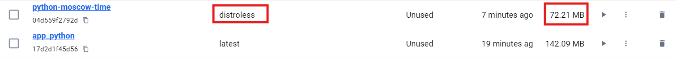

# Python Web Application

## Overview

This project is a Python web application built using the Flask framework.
It displays the current time in Moscow and demonstrates how to create a simple web
service that provides meaningful real-time information in a lightweight and user-friendly manner.

## Features

- **Dynamic Functionality:** The application performs a specific task - displaying real-time data.
- **Scalable and Portable:** Containerized using Docker for easy deployment and scalability.
- **Visits Monitoring:** `/visits` endpoint counter, which save number of visits in the visits.txt, and also docker-compose.yml contains volume `python_app_visits_data` added to store visits file

## Frameworks and Technologies

- **Flask Framework:** A lightweight and easy-to-use Python framework for building web applications.
- **Docker:** For containerizing the application to ensure a consistent and portable runtime environment.

## Installation

### Local Installation

1. Clone the repository:

   ```bash
   git clone https://github.com/yourusername/yourproject
   ```

2. Navigate to the project directory:

   ```bash
    cd app_python
   ```

3. Install the required dependencies:

   ```bash
    pip install -r requirements.txt
   ```

4. Run the application:

   ```bash
   python app.py
   ```

5. Open your web browser and navigate to `http://localhost:5000/` to view the application.

### Docker Instruction

1. To build the Docker image run the following command in the terminal from the `app_python` directory with Dockerfile present:

   ```bash
   docker build -t app_python .
   ```

2. To run the Docker image:

   ```bash
   docker run -p 5000:5000 app_python
   ```

3. Alternatively, you can pull the Docker image from my [Dockerhub repository](https://hub.docker.com/r/vladis7love/app_python) using the following commands:

   ```bash
   docker login
   docker pull vladis7love/app_python:latest
   docker run -p 5000:5000 vladis7love/app_python
   ```

## Distroless Images

### Differences Between Distroless Images and Previous Images

1. **Size**:
   - Distroless images are significantly smaller than traditional base images (e.g., `python:slim`, `node:alpine`).
   - They only include the application runtime and its minimal dependencies, reducing bloat.

2. **Security**:
   - Distroless images remove package managers, shells, and other utilities that could be exploited by attackers.
   - They are built to follow the principle of "least privilege."

3. **Non-Root Execution**:
   - By default, Distroless images run as a non-root user, enhancing container security.

4. **Compatibility**:
   - Distroless images are optimized for production environments, ensuring that app runs with only what's strictly necessary.

### Size Comparison



### Running

```bash
    docker build -t app_python:distroless -f Distroless.Dockerfile .
    docker run -p 5000:5000 app_python:distroless
   ```

## Unit Testing

Unit tests are implemented to verify the correctness of the application. These tests cover the following areas:

- Response Code: Ensures the home page loads successfully.

- Time Format Validation: Confirms that the displayed time follows the expected format.

To run the tests locally, execute the following command:
```bash
python -m unittest app_test.TestApp
```

## Continuous Integration (CI) and Automated Deployment

In addition to building, testing, linting, and performing security checks, our CI pipeline supports automated deployment of the Docker image to a production environment. This ensures that updates are delivered quickly and reliably, reducing the time between code changes and their availability to end-users.

### Key CI/CD Steps

- **Build:**  
  Every push to the repository triggers the build process, which installs dependencies, runs linting via `flake8`, and compiles the application. This early validation helps catch syntax and structural issues.

- **Test:**  
  Unit tests are executed to validate the application's functionality, and a Snyk security scan is performed to detect any high-severity vulnerabilities. This comprehensive testing approach ensures that new changes do not compromise the app’s integrity or security.

- **Docker Build & Publish:**  
  The pipeline logs into Docker Hub, builds the Docker image tagged as `latest`, and pushes it to the repository. This guarantees a consistent runtime environment and simplifies subsequent deployments.

- **Deploy:**  
  An additional deployment step can automatically update the application on a remote server. After a successful Docker build and push, the pipeline can use SSH to pull the latest image and restart the container.

