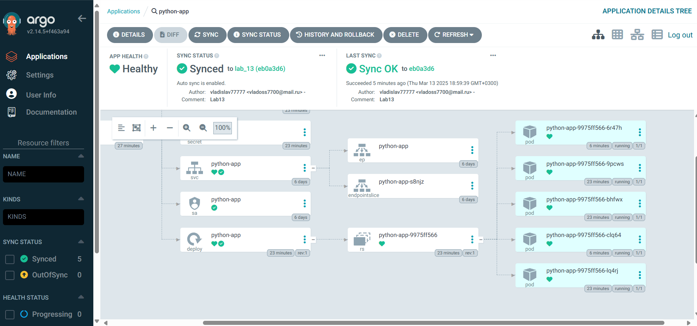
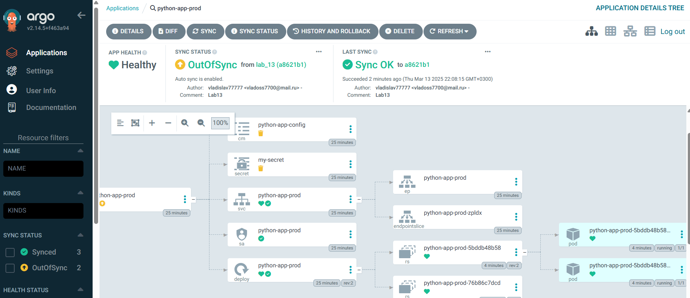
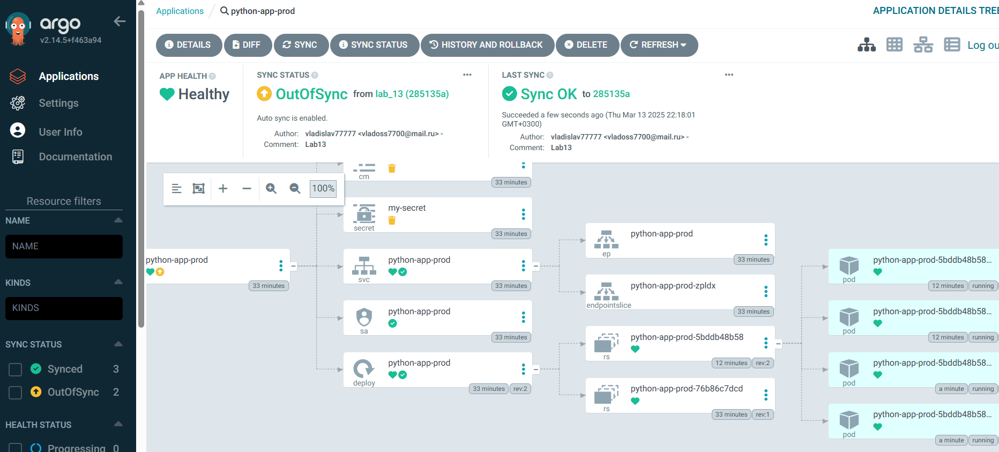
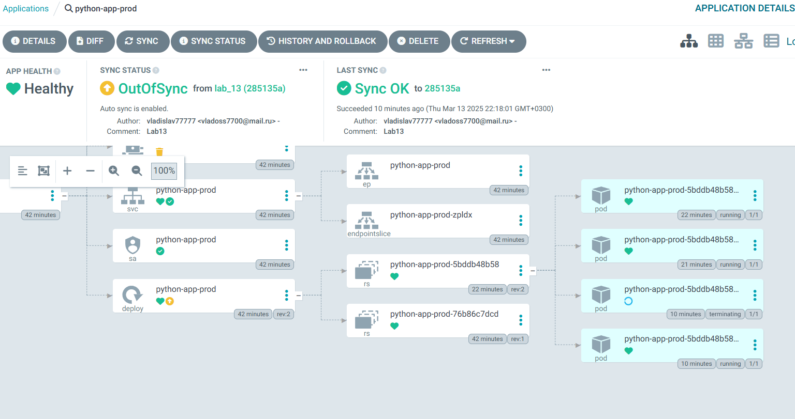
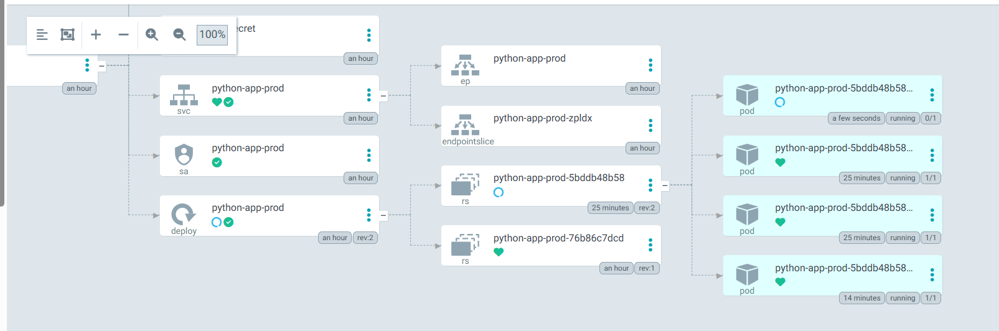
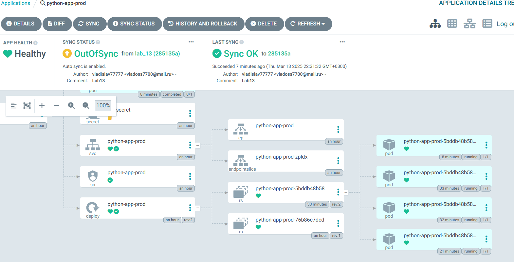
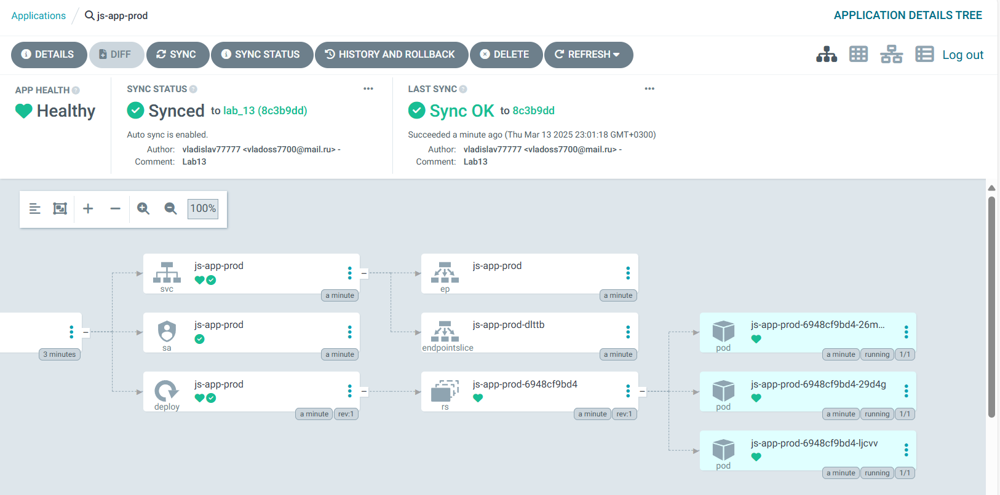

# Lab 13: ArgoCD for GitOps Deployment

## Task 1: Deploy and Configure ArgoCD

Let's deploy and check argoCD:

```bash
PS C:\Users\Vladi\PycharmProjects\S25-core-course-labs\k8s> kubectl apply -f ArgoCD/argocd-python-app.yaml
application.argoproj.io/python-app configured

PS C:\Users\Vladi\PycharmProjects\S25-core-course-labs\k8s> argocd app sync python-app          
TIMESTAMP  GROUP        KIND   NAMESPACE                  NAME    STATUS   HEALTH        HOOK  MESSAGE
2025-03-13T18:40:50+03:00         ServiceAccount     default            python-app  OutOfSync   

2025-03-13T18:40:50+03:00   apps  Deployment         default            python-app  OutOfSync  Missing
2025-03-13T18:40:50+03:00          ConfigMap         default     python-app-config  OutOfSync  Missing
2025-03-13T18:40:50+03:00             Secret         default             my-secret  OutOfSync  Missing
2025-03-13T18:40:50+03:00            Service         default            python-app  OutOfSync  Healthy
2025-03-13T18:40:50+03:00                Pod     default       preinstall-hook                  

2025-03-13T18:40:52+03:00                Pod     default       preinstall-hook   Running   Synced     PreSync  pod/preinstall-hook created
2025-03-13T18:41:12+03:00         ServiceAccount     default            python-app    Synced    

2025-03-13T18:41:12+03:00             Secret     default             my-secret    Synced  Missing
2025-03-13T18:41:12+03:00          ConfigMap     default     python-app-config    Synced  Missing
2025-03-13T18:41:12+03:00            Service     default            python-app    Synced  Healthy
2025-03-13T18:41:13+03:00   apps  Deployment     default            python-app    Synced  Progressing
2025-03-13T18:41:14+03:00                Pod         default       preinstall-hook  Succeeded   Synced         PreSync  pod/preinstall-hook created
2025-03-13T18:41:14+03:00         ServiceAccount     default            python-app    Synced    
                        serviceaccount/python-app configured. Warning: resource serviceaccounts/
python-app is missing the kubectl.kubernetes.io/last-applied-configuration annotation which is r
equired by  apply.  apply should only be used on resources created declaratively by either  create --save-config or  apply. The missing annotation will be patched automatically.
2025-03-13T18:41:14+03:00             Secret         default             my-secret    Synced   Missing                  secret/my-secret created
2025-03-13T18:41:14+03:00          ConfigMap         default     python-app-config    Synced   Missing                  configmap/python-app-config created
2025-03-13T18:41:14+03:00            Service         default            python-app    Synced   H
ealthy                  service/python-app configured. Warning: resource services/python-app is 
missing the kubectl.kubernetes.io/last-applied-configuration annotation which is required by  ap
ply.  apply should only be used on resources created declaratively by either  create --save-config or  apply. The missing annotation will be patched automatically.
2025-03-13T18:41:14+03:00   apps  Deployment         default            python-app    Synced   Progressing              deployment.apps/python-app created
2025-03-13T18:41:26+03:00   apps  Deployment     default            python-app    Synced  Healthy              deployment.apps/python-app created
2025-03-13T18:41:26+03:00                Pod     default      postinstall-hook   Running   Synced    PostSync  pod/postinstall-hook created
2025-03-13T18:41:49+03:00                Pod     default      postinstall-hook  Succeeded   Synced    PostSync  pod/postinstall-hook created

Name:               argocd/python-app
Project:            default
Server:             https://kubernetes.default.svc
Namespace:          default
URL:                https://argocd.example.com/applications/python-app
Source:
- Repo:             https://github.com/vladislav77777/S25-core-course-labs.git
  Target:           lab_13
  Path:             k8s/python-app
  Helm Values:      values.yaml
SyncWindow:         Sync Allowed
Sync Policy:        Automated
Sync Status:        Synced to lab_13 (a2dce68)
Health Status:      Healthy

Operation:          Sync
Sync Revision:      a2dce68996e0de05288f3761a9f937273ac9a977
Phase:              Succeeded
Start:              2025-03-13 18:40:47 +0300 MSK
Finished:           2025-03-13 18:41:47 +0300 MSK
Duration:           1m0s
Message:            successfully synced (no more tasks)

GROUP  KIND            NAMESPACE  NAME               STATUS     HEALTH   HOOK      MESSAGE      
       Pod             default    preinstall-hook    Succeeded           PreSync   pod/preinstall-hook created
       ServiceAccount  default    python-app         Synced                        serviceaccoun
t/python-app configured. Warning: resource serviceaccounts/python-app is missing the kubectl.kub
ernetes.io/last-applied-configuration annotation which is required by  apply.  apply should only
 be used on resources created declaratively by either  create --save-config or  apply. The missing annotation will be patched automatically.
       Secret          default    my-secret          Synced                        secret/my-secret created
       ConfigMap       default    python-app-config  Synced                        configmap/python-app-config created
       Service         default    python-app         Synced     Healthy            service/pytho
n-app configured. Warning: resource services/python-app is missing the kubectl.kubernetes.io/las
t-applied-configuration annotation which is required by  apply.  apply should only be used on re
sources created declaratively by either  create --save-config or  apply. The missing annotation will be patched automatically.
apps   Deployment      default    python-app         Synced     Healthy            deployment.apps/python-app created
       Pod             default    postinstall-hook   Succeeded           PostSync  pod/postinstall-hook created
```

And we can get more information:

```bash
PS C:\Users\Vladi\PycharmProjects\S25-core-course-labs\k8s> argocd app get python-app   
Name:               argocd/python-app
Project:            default
Server:             https://kubernetes.default.svc
Namespace:          default
URL:                https://argocd.example.com/applications/python-app
Source:
- Repo:             https://github.com/vladislav77777/S25-core-course-labs.git
  Target:           lab_13
  Path:             k8s/python-app
  Helm Values:      values.yaml
SyncWindow:         Sync Allowed
Sync Policy:        Automated
Sync Status:        Synced to lab_13 (a2dce68)
Health Status:      Healthy

GROUP  KIND            NAMESPACE  NAME               STATUS     HEALTH   HOOK      MESSAGE      
       Pod             default    preinstall-hook    Succeeded           PreSync   pod/preinstall-hook created
       ServiceAccount  default    python-app         Synced                        serviceaccoun
t/python-app configured. Warning: resource serviceaccounts/python-app is missing the kubectl.kub
ernetes.io/last-applied-configuration annotation which is required by  apply.  apply should only
 be used on resources created declaratively by either  create --save-config or  apply. The missing annotation will be patched automatically.
       Secret          default    my-secret          Synced                        secret/my-secret created
       ConfigMap       default    python-app-config  Synced                        configmap/python-app-config created
       Service         default    python-app         Synced     Healthy            service/pytho
n-app configured. Warning: resource services/python-app is missing the kubectl.kubernetes.io/las
t-applied-configuration annotation which is required by  apply.  apply should only be used on re
sources created declaratively by either  create --save-config or  apply. The missing annotation will be patched automatically.
apps   Deployment      default    python-app         Synced     Healthy            deployment.apps/python-app created
       Pod             default    postinstall-hook   Succeeded           PostSync  pod/postinstall-hook created
```

So, we can check - the default number of Pods for python-app Deployment is 3 in my configuration:

```bash
PS C:\Users\Vladi\PycharmProjects\S25-core-course-labs\k8s>  kubectl get pods           
NAME                         READY   STATUS    RESTARTS   AGE
python-app-9975ff566-9pcws   1/1     Running   0          17m
python-app-9975ff566-bhfwx   1/1     Running   0          17m
python-app-9975ff566-lq4rj   1/1     Running   0          17m
```

Then, after updating the repo, the number of pods were increased to 5 (`replicaCount: 5`):

```bash
PS C:\Users\Vladi\PycharmProjects\S25-core-course-labs\k8s>  kubectl get pods
NAME                         READY   STATUS    RESTARTS   AGE
python-app-9975ff566-6r47h   1/1     Running   0          2m22s
python-app-9975ff566-9pcws   1/1     Running   0          20m
python-app-9975ff566-bhfwx   1/1     Running   0          20m
python-app-9975ff566-clq64   1/1     Running   0          2m22s
python-app-9975ff566-lq4rj   1/1     Running   0          20m
```

We can see 5 pods here:


## Task 2: Multi-Environment Deployment & Auto-Sync

The following screenshots demonstrate the result of manually increasing replicaСount on our deployment python-app-prod
from 2 to 4.

```bash
PS C:\Users\Vladi\PycharmProjects\S25-core-course-labs\k8s> argocd app sync python-app-prod
TIMESTAMP                  GROUP        KIND       NAMESPACE                  NAME    STATUS    HEALTH        HOOK  MESSAGE
2025-03-13T22:07:31+03:00          ConfigMap         default     python-app-config  OutOfSync
2025-03-13T22:07:31+03:00             Secret            prod             my-secret  OutOfSync
2025-03-13T22:07:31+03:00            Service            prod       python-app-prod    Synced   Healthy
2025-03-13T22:07:31+03:00         ServiceAccount        prod       python-app-prod    Synced
2025-03-13T22:07:31+03:00   apps  Deployment            prod       python-app-prod    Synced   Healthy
2025-03-13T22:07:31+03:00                Pod        prod       preinstall-hook                                 
2025-03-13T22:07:33+03:00                Pod        prod       preinstall-hook   Running   Synced     PreSync  pod/preinstall-hook created
2025-03-13T22:07:53+03:00                Pod            prod       preinstall-hook  Succeeded   Synced     PreSync  pod/preinstall-hook created
2025-03-13T22:07:53+03:00             Secret            prod             my-secret  OutOfSync                       ignored (requires pruning)
2025-03-13T22:07:53+03:00          ConfigMap         default     python-app-config  OutOfSync                       ignored (requires pruning)
2025-03-13T22:07:53+03:00         ServiceAccount        prod       python-app-prod    Synced                        serviceaccount/python-app-prod unchanged
2025-03-13T22:07:53+03:00            Service            prod       python-app-prod    Synced   Healthy              service/python-app-prod unchanged
2025-03-13T22:07:53+03:00   apps  Deployment            prod       python-app-prod    Synced   Healthy              deployment.apps/python-app-prod unchanged
2025-03-13T22:07:53+03:00                Pod        prod      postinstall-hook   Running   Synced    PostSync  pod/postinstall-hook created
2025-03-13T22:08:17+03:00                Pod        prod      postinstall-hook  Succeeded   Synced    PostSync  pod/postinstall-hook created

Name:               argocd/python-app-prod
Project:            default
Server:             https://kubernetes.default.svc
Namespace:          prod
URL:                https://argocd.example.com/applications/python-app-prod
Source:
- Repo:             https://github.com/vladislav77777/S25-core-course-labs.git
  Target:           lab_13
  Path:             k8s/python-app
  Helm Values:      values-prod.yaml
SyncWindow:         Sync Allowed
Sync Policy:        Automated
Sync Status:        OutOfSync from lab_13 (a8621b1)
Health Status:      Healthy

Operation:          Sync
Sync Revision:      a8621b1554a524b761acb5f8a35b96ab69dd7c5e
Phase:              Succeeded
Start:              2025-03-13 22:07:27 +0300 MSK
Finished:           2025-03-13 22:08:15 +0300 MSK
Duration:           48s
Message:            successfully synced (no more tasks)
ed (requires pruning)
       ServiceAccount  prod       python-app-prod    Synced                        serviceaccount/python-app-prod unchanged
       Service         prod       python-app-prod    Synced     Healthy            service/python-app-prod unchanged
apps   Deployment      prod       python-app-prod    Synced     Healthy            deployment.apps/python-app-prod unchanged
       Pod             prod       postinstall-hook   Succeeded           PostSync  pod/postinstall-hook created
```

Before updating repo:

```bash
PS C:\Users\Vladi\PycharmProjects\S25-core-course-labs> kubectl get po -n prod
NAME                               READY   STATUS    RESTARTS   AGE
python-app-prod-5bddb48b58-d9qq7   1/1     Running   0          2m20s
python-app-prod-5bddb48b58-k2vsd   1/1     Running   0          2m8s
```



After updating repo:

```bash
PS C:\Users\Vladi\PycharmProjects\S25-core-course-labs> kubectl get po -n prod
NAME                               READY   STATUS      RESTARTS   AGE
postinstall-hook                   1/1     Running     0          15s
preinstall-hook                    0/1     Completed   0          48s
python-app-prod-5bddb48b58-d9qq7   1/1     Running     0          11m
python-app-prod-5bddb48b58-k2vsd   1/1     Running     0          11m
python-app-prod-5bddb48b58-mbtd9   1/1     Running     0          27s
python-app-prod-5bddb48b58-mjljp   1/1     Running     0          27s
```



### Self-Heal Testing

#### Test 1: Manual Override of Replica Count

Let's specify new replicas - 3 pods instead of 4.

```bash
PS C:\Users\Vladi\PycharmProjects\S25-core-course-labs> @"
>> {
>> "spec": {
>>      "replicas": 3
>>    }
>> }
>> "@ | Out-File -FilePath patch.json -Encoding utf8

PS C:\Users\Vladi\PycharmProjects\S25-core-course-labs> kubectl patch deployment python-app-prod -n prod --patch-file patch.json    
deployment.apps/python-app-prod patched
```

We can check that one pod terminates:


```bash
PS C:\Users\Vladi\PycharmProjects\S25-core-course-labs> kubectl get po -n prod
NAME                               READY   STATUS    RESTARTS   AGE
python-app-prod-5bddb48b58-d9qq7   1/1     Running   0          24m
python-app-prod-5bddb48b58-k2vsd   1/1     Running   0          23m
python-app-prod-5bddb48b58-mjljp   1/1     Running   0          13m
```

And after sync it returns back to 4 pods:


```bash
PS C:\Users\Vladi\PycharmProjects\S25-core-course-labs> kubectl get po -n prod
NAME                               READY   STATUS    RESTARTS   AGE
python-app-prod-5bddb48b58-bz7s6   1/1     Running   0          73s
python-app-prod-5bddb48b58-d9qq7   1/1     Running   0          25m
python-app-prod-5bddb48b58-k2vsd   1/1     Running   0          25m
python-app-prod-5bddb48b58-mjljp   1/1     Running   0          14m
```



#### Test 2: Delete a Pod (Replica)

Let's explore the list of pods before deletion:

```bash
PS C:\Users\Vladi\PycharmProjects\S25-core-course-labs> kubectl get po -n prod
NAME                               READY   STATUS    RESTARTS   AGE
python-app-prod-5bddb48b58-bz7s6   1/1     Running   0          8m45s
python-app-prod-5bddb48b58-d9qq7   1/1     Running   0          33m
python-app-prod-5bddb48b58-k2vsd   1/1     Running   0          33m
python-app-prod-5bddb48b58-mjljp   1/1     Running   0          22m


PS C:\Users\Vladi\PycharmProjects\S25-core-course-labs> kubectl delete pods -n prod python-app-prod-5bddb48b58-bz7s6
pod "python-app-prod-5bddb48b58-bz7s6" deleted
```

And we can verify Kubernetes recreates the pod to match the deployment’s replicaCount:4

```bash
PS C:\Users\Vladi\PycharmProjects\S25-core-course-labs\k8s> kubectl get po -n prod      
NAME                               READY   STATUS        RESTARTS   AGE                 
python-app-prod-5bddb48b58-bz7s6   1/1     Terminating   0          9m34s               
python-app-prod-5bddb48b58-d9qq7   1/1     Running       0          34m
python-app-prod-5bddb48b58-ggnkp   0/1     Running       0          12s
python-app-prod-5bddb48b58-k2vsd   1/1     Running       0          34m
python-app-prod-5bddb48b58-mjljp   1/1     Running       0          23m

PS C:\Users\Vladi\PycharmProjects\S25-core-course-labs\k8s> kubectl get po -n prod
NAME                               READY   STATUS    RESTARTS   AGE
python-app-prod-5bddb48b58-d9qq7   1/1     Running   0          35m
python-app-prod-5bddb48b58-ggnkp   1/1     Running   0          70s
python-app-prod-5bddb48b58-k2vsd   1/1     Running   0          35m
python-app-prod-5bddb48b58-mjljp   1/1     Running   0          24m
```

And we have no drifts:

```bash
PS C:\Users\Vladi\PycharmProjects\S25-core-course-labs\k8s> argocd app diff python-app-prod
```


#### How ArgoCD handles configuration drift vs. runtime events

ArgoCD detects configuration drift by continuously comparing the desired state (from Git) with the live state in the
cluster. If differences exist, it marks the application as OutOfSync and can automatically or manually sync it back.

Runtime events, such as pod restarts or temporary failures, do not affect ArgoCD’s sync status since they do not alter
the declared configuration. ArgoCD focuses on maintaining the state defined in Git, not runtime deviations.

## Bonus Task: Sync Your Bonus App with ArgoCD

The same with 3 replicas for bonus app:


```bash
PS C:\Users\Vladi\PycharmProjects\S25-core-course-labs\k8s> kubectl apply -f ArgoCD/argocd-javascript-prod.yaml
application.argoproj.io/js-app-prod configured
PS C:\Users\Vladi\PycharmProjects\S25-core-course-labs\k8s> argocd app sync js-app-prod 
TIMESTAMP                  GROUP        KIND       NAMESPACE                  NAME    STATUS   HEALTH            HOOK  MESSAGE
2025-03-13T23:01:19+03:00            Service            prod           js-app-prod    Synced  Healthy
2025-03-13T23:01:19+03:00         ServiceAccount        prod           js-app-prod    Synced
2025-03-13T23:01:19+03:00   apps  Deployment            prod           js-app-prod    Synced  Progressing
2025-03-13T23:01:20+03:00         ServiceAccount        prod           js-app-prod    Synced                           serviceaccount/js-app-prod unchanged
2025-03-13T23:01:20+03:00            Service            prod           js-app-prod    Synced  Healthy                  service/js-app-prod unchanged
2025-03-13T23:01:20+03:00   apps  Deployment            prod           js-app-prod    Synced  Progressing              deployment.apps/js-app-prod configured

Name:               argocd/js-app-prod
Project:            default
Server:             https://kubernetes.default.svc
Namespace:          prod
URL:                https://argocd.example.com/applications/js-app-prod
Source:
- Repo:             https://github.com/vladislav77777/S25-core-course-labs.git
  Target:           lab_13
  Path:             k8s/js-app
  Helm Values:      values.yaml
SyncWindow:         Sync Allowed
Sync Policy:        Automated (Prune)
Sync Status:        Synced to lab_13 (8c3b9dd)
Health Status:      Progressing

Operation:          Sync
Sync Revision:      8c3b9dd266b53706903d110044ec10e9ab24475c
Phase:              Succeeded
Start:              2025-03-13 23:01:17 +0300 MSK
Finished:           2025-03-13 23:01:18 +0300 MSK
Duration:           1s
Message:            successfully synced (all tasks run)

GROUP  KIND            NAMESPACE  NAME         STATUS  HEALTH       HOOK  MESSAGE       
       ServiceAccount  prod       js-app-prod  Synced                     serviceaccount/js-app-prod unchanged
       Service         prod       js-app-prod  Synced  Healthy            service/js-app-prod unchanged
apps   Deployment      prod       js-app-prod  Synced  Progressing        deployment.apps/js-app-prod configured

PS C:\Users\Vladi\PycharmProjects\S25-core-course-labs\k8s> kubectl get po -n prod
NAME                               READY   STATUS    RESTARTS   AGE
js-app-prod-6948cf9bd4-26mvm       1/1     Running   0          2m31s
js-app-prod-6948cf9bd4-29d4g       1/1     Running   0          2m31s
js-app-prod-6948cf9bd4-ljcvv       1/1     Running   0          2m31s
```
