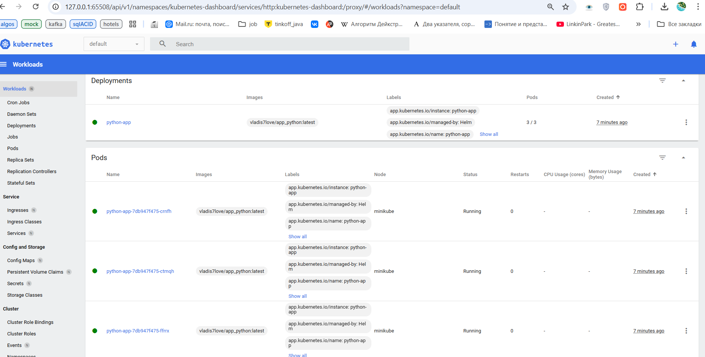
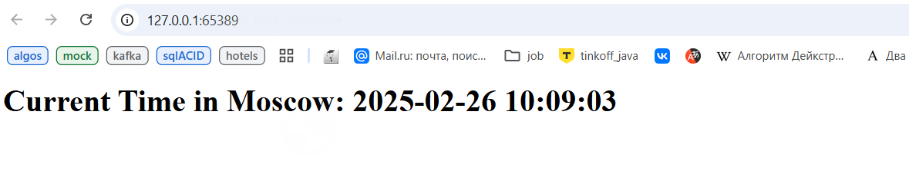

# **Helm**

## Task 1: Helm Setup and Chart Creation

```bash
PS C:\Users\Vladi\PycharmProjects\S25-core-course-labs\k8s> helm install python-app .\python-app
NAME: python-app
LAST DEPLOYED: Wed Feb 26 10:03:13 2025
NAMESPACE: default
STATUS: deployed
REVISION: 1
NOTES:
1. Get the application URL by running these commands:
  export POD_NAME=$(kubectl get pods --namespace default -l "app.kubernetes.io/name=python-app,app.kubernetes.io/instance=python-app" -o jsonpath="{.items[0].metadata.name}")  
  export CONTAINER_PORT=$(kubectl get pod --namespace default $POD_NAME -o jsonpath="{.spec.containers[0].ports[0].containerPort}")
  echo "Visit http://127.0.0.1:8080 to use your application"
  kubectl --namespace default port-forward $POD_NAME 8080:$CONTAINER_PORT

PS C:\Users\Vladi\PycharmProjects\S25-core-course-labs\k8s> helm list
NAME            NAMESPACE       REVISION        UPDATED                                STATUS   CHART                   APP VERSION
python-app      default         1               2025-02-26 10:03:13.0135397 +0300 MSK  deployed python-app-0.1.0        1.16.0
    
PS C:\Users\Vladi\PycharmProjects\S25-core-course-labs\k8s> kubectl get pods,svc        
NAME                              READY   STATUS    RESTARTS   AGE
pod/python-app-7db947f475-crnfh   1/1     Running   0          5m8s
pod/python-app-7db947f475-ctmqh   1/1     Running   0          5m8s
pod/python-app-7db947f475-ffrrx   1/1     Running   0          5m8s

NAME                 TYPE        CLUSTER-IP      EXTERNAL-IP   PORT(S)    AGE
service/kubernetes   ClusterIP   10.96.0.1       <none>        443/TCP    25h
service/python-app   ClusterIP   10.107.50.107   <none>        5000/TCP   5m8s

PS C:\Users\Vladi\PycharmProjects\S25-core-course-labs\k8s> minikube service python-app
|-----------|------------|-------------|--------------|
| NAMESPACE |    NAME    | TARGET PORT |     URL      |
|-----------|------------|-------------|--------------|
| default   | python-app |             | No node port |
|-----------|------------|-------------|--------------|
* service default/python-app has no node port
! Services [default/python-app] have type "ClusterIP" not meant to be exposed, however for local development minikube allows you to access this !
* Starting tunnel for service python-app.
|-----------|------------|-------------|------------------------|
| NAMESPACE |    NAME    | TARGET PORT |          URL           |
|-----------|------------|-------------|------------------------|
| default   | python-app |             | http://127.0.0.1:65389 |
|-----------|------------|-------------|------------------------|
* Opening service default/python-app in default browser...
! Because you are using a Docker driver on windows, the terminal needs to be open to run it.
```




## Task 2: Helm Chart Hooks

Let's write pre and post hooks with `sleep 20`

### Troubleshoot Hooks:

```bash
PS C:\Users\Vladi\PycharmProjects\S25-core-course-labs\k8s> helm lint python-app
==> Linting python-app
[INFO] Chart.yaml: icon is recommended
1 chart(s) linted, 0 chart(s) failed


PS C:\Users\Vladi\PycharmProjects\S25-core-course-labs\k8s> helm install --dry-run helm-hooks python-app
NAME: helm-hooks
LAST DEPLOYED: Wed Feb 26 10:55:37 2025
NAMESPACE: default
STATUS: pending-install
REVISION: 1
HOOKS:
---
# Source: python-app/templates/tests/test-connection.yaml
apiVersion: v1
kind: Pod
metadata:
  name: "helm-hooks-python-app-test-connection"
  labels:
    helm.sh/chart: python-app-0.1.0
    app.kubernetes.io/name: python-app
    app.kubernetes.io/instance: helm-hooks
    app.kubernetes.io/version: "1.16.0"
    app.kubernetes.io/managed-by: Helm
  annotations:
    "helm.sh/hook": test
spec:
  containers:
    - name: wget
      image: busybox
      command: ['wget']
      args: ['helm-hooks-python-app:5000']
  restartPolicy: Never
---
# Source: python-app/templates/post-install-hook.yml
apiVersion: v1
kind: Job
metadata:
   generateName: postinstall-hook
   annotations:
       "helm.sh/hook": "post-install"
       "helm.sh/hook-delete-policy": "hook-succeeded"
spec:
  containers:
  - name: post-install-container
    image: busybox
    imagePullPolicy: IfNotPresent
    command: ["sleep", "20"]
  restartPolicy: Never
---
# Source: python-app/templates/pre-install-hook.yml
apiVersion: v1
kind: Job
metadata:
   generateName: pre-install-hook
   annotations:
       "helm.sh/hook": "pre-install"
       "helm.sh/hook-delete-policy": "hook-succeeded"
spec:
  containers:
  - name: pre-install-container
    image: busybox
    command: ["sleep", "20"]
    imagePullPolicy: IfNotPresent
  restartPolicy: Never
MANIFEST:
---
# Source: python-app/templates/serviceaccount.yaml
apiVersion: v1
kind: ServiceAccount
metadata:
  name: helm-hooks-python-app
  labels:
    helm.sh/chart: python-app-0.1.0
    app.kubernetes.io/name: python-app
    app.kubernetes.io/instance: helm-hooks
    app.kubernetes.io/version: "1.16.0"
    app.kubernetes.io/managed-by: Helm
automountServiceAccountToken: true
---
# Source: python-app/templates/service.yaml
apiVersion: v1
kind: Service
metadata:
  name: helm-hooks-python-app
  labels:
    helm.sh/chart: python-app-0.1.0
    app.kubernetes.io/name: python-app
    app.kubernetes.io/instance: helm-hooks
    app.kubernetes.io/version: "1.16.0"
    app.kubernetes.io/managed-by: Helm
spec:
  type: ClusterIP
  ports:
    - port: 5000
      targetPort: http
      protocol: TCP
      name: http
  selector:
    app.kubernetes.io/name: python-app
    app.kubernetes.io/instance: helm-hooks
---
# Source: python-app/templates/deployment.yaml
apiVersion: apps/v1
kind: Deployment
metadata:
  name: helm-hooks-python-app
  labels:
    helm.sh/chart: python-app-0.1.0
    app.kubernetes.io/name: python-app
    app.kubernetes.io/instance: helm-hooks
    app.kubernetes.io/version: "1.16.0"
    app.kubernetes.io/managed-by: Helm
spec:
  replicas: 3
  selector:
    matchLabels:
      app.kubernetes.io/name: python-app
      app.kubernetes.io/instance: helm-hooks
  template:
    metadata:
      labels:
        helm.sh/chart: python-app-0.1.0
        app.kubernetes.io/name: python-app
        app.kubernetes.io/instance: helm-hooks
        app.kubernetes.io/version: "1.16.0"
        app.kubernetes.io/managed-by: Helm
    spec:
      serviceAccountName: helm-hooks-python-app
      containers:
        - name: python-app
          image: "vladis7love/app_python:latest"
          imagePullPolicy: IfNotPresent
          ports:
            - name: http
              containerPort: 5000
              protocol: TCP
          livenessProbe:
            httpGet:
              path: /
              port: http
          readinessProbe:
            httpGet:
              path: /
              port: http

NOTES:
1. Get the application URL by running these commands:
  export POD_NAME=$(kubectl get pods --namespace default -l "app.kubernetes.io/name=python-app,app.kubernetes.io/instance=helm-hooks" -o jsonpath="{.items[0].metadata.name}")  
  export CONTAINER_PORT=$(kubectl get pod --namespace default $POD_NAME -o jsonpath="{.spec.containers[0].ports[0].containerPort}")
  echo "Visit http://127.0.0.1:8080 to use your application"
  kubectl --namespace default port-forward $POD_NAME 8080:$CONTAINER_PORT
```

### Provide Output:

```bash
PS C:\Users\Vladi\PycharmProjects\S25-core-course-labs\k8s> kubectl get po              

NAME                                 READY   STATUS      RESTARTS   AGE
post-install-hook-python-app-6h82t   0/1     Completed   0          25s
pre-install-hook-g7hsw-4mfnz         0/1     Completed   0          80m
python-app-7db947f475-7zb54          1/1     Running     0          25s
python-app-7db947f475-bgtnh          1/1     Running     0          25s
python-app-7db947f475-tfxsp          1/1     Running     0          25s
```

```bash
PS C:\Users\Vladi\PycharmProjects\S25-core-course-labs\k8s> kubectl describe pod pre-install-hook-g7hsw-4mfnz

Name:             pre-install-hook-g7hsw-4mfnz
Namespace:        default
Priority:         0
Service Account:  default
Node:             minikube/192.168.49.2
Start Time:       Wed, 26 Feb 2025 11:09:00 +0300
Labels:           batch.kubernetes.io/controller-uid=20797f81-1074-49f7-ac29-dfd977135205
                  batch.kubernetes.io/job-name=pre-install-hook-g7hsw
                  controller-uid=20797f81-1074-49f7-ac29-dfd977135205
                  job-name=pre-install-hook-g7hsw
Annotations:      <none>
Status:           Succeeded
IP:               10.244.0.66
IPs:
  IP:           10.244.0.66
Controlled By:  Job/pre-install-hook-g7hsw
Containers:
  pre-install-container:
    Container ID:  docker://82abd449b50bc88cd253de50b34fe693d465de7d974136d0ecc797ae3b2f6180
    Image:         busybox
    Image ID:      docker-pullable://busybox@sha256:498a000f370d8c37927118ed80afe8adc38d1edcbfc071627d17b25c88efcab0
    Port:          <none>
    Host Port:     <none>
    Command:
      sleep
      20
    State:          Terminated
      Reason:       Completed
      Exit Code:    0
      Started:      Wed, 26 Feb 2025 11:09:01 +0300
      Finished:     Wed, 26 Feb 2025 11:09:21 +0300
    Ready:          False
    Restart Count:  0
    Environment:    <none>
    Mounts:
      /var/run/secrets/kubernetes.io/serviceaccount from kube-api-access-675fq (ro)     
Conditions:
  Type                        Status
  PodReadyToStartContainers   False
  Initialized                 True
  Ready                       False
  ContainersReady             False
  PodScheduled                True
Volumes:
  kube-api-access-675fq:
    Type:                    Projected (a volume that contains injected data from multiple sources)
    TokenExpirationSeconds:  3607
    ConfigMapName:           kube-root-ca.crt
    ConfigMapOptional:       <nil>
    DownwardAPI:             true
QoS Class:                   BestEffort
Node-Selectors:              <none>
Tolerations:                 node.kubernetes.io/not-ready:NoExecute op=Exists for 300s  
                             node.kubernetes.io/unreachable:NoExecute op=Exists for 300s
Events:
  Type    Reason     Age   From               Message
  ----    ------     ----  ----               -------
  Normal  Scheduled  82m   default-scheduler  Successfully assigned default/pre-install-hook-g7hsw-4mfnz to minikube
  Normal  Pulled     82m   kubelet            Container image "busybox" already present on machine
  Normal  Created    82m   kubelet            Created container: pre-install-container  
  Normal  Started    82m   kubelet            Started container pre-install-container 
```

```bash
PS C:\Users\Vladi\PycharmProjects\S25-core-course-labs\k8s> kubectl describe pod post-install-hook-python-app-6h82t

Name:             post-install-hook-python-app-6h82t
Namespace:        default
Priority:         0
Service Account:  default
Node:             minikube/192.168.49.2
Start Time:       Wed, 26 Feb 2025 12:29:30 +0300
Labels:           batch.kubernetes.io/controller-uid=104d27da-00e7-4198-9af8-7a516e21ed90
                  batch.kubernetes.io/job-name=post-install-hook-python-app
                  controller-uid=104d27da-00e7-4198-9af8-7a516e21ed90
                  job-name=post-install-hook-python-app
Annotations:      <none>
Status:           Succeeded
IP:               10.244.0.73
IPs:
  IP:           10.244.0.73
Controlled By:  Job/post-install-hook-python-app
Containers:
  post-install-container:
    Container ID:  docker://aea88ee8ca9e2f2c819f162f055dcf061ee9f29af8eb302314fce18b8295b95b
    Image:         busybox
    Image ID:      docker-pullable://busybox@sha256:498a000f370d8c37927118ed80afe8adc38d1edcbfc071627d17b25c88efcab0
    Port:          <none>
    Host Port:     <none>
    Command:
      sleep
      20
    State:          Terminated
      Reason:       Completed
      Exit Code:    0
      Started:      Wed, 26 Feb 2025 12:29:31 +0300
      Finished:     Wed, 26 Feb 2025 12:29:51 +0300
    Ready:          False
    Restart Count:  0
    Environment:    <none>
    Mounts:
      /var/run/secrets/kubernetes.io/serviceaccount from kube-api-access-5krhp (ro)     
Conditions:
  Type                        Status
  PodReadyToStartContainers   False
  Initialized                 True
  Ready                       False
  ContainersReady             False
  PodScheduled                True
Volumes:
  kube-api-access-5krhp:
    Type:                    Projected (a volume that contains injected data from multiple sources)
    TokenExpirationSeconds:  3607
    ConfigMapName:           kube-root-ca.crt
    ConfigMapOptional:       <nil>
    DownwardAPI:             true
QoS Class:                   BestEffort
Node-Selectors:              <none>
Tolerations:                 node.kubernetes.io/not-ready:NoExecute op=Exists for 300s  
                             node.kubernetes.io/unreachable:NoExecute op=Exists for 300s
Events:
  Type    Reason     Age    From               Message
  ----    ------     ----   ----               -------
  Normal  Scheduled  2m43s  default-scheduler  Successfully assigned default/post-install-hook-python-app-6h82t to minikube
  Normal  Pulled     2m42s  kubelet            Container image "busybox" already present on machine
  Normal  Created    2m42s  kubelet            Created container: post-install-container
  Normal  Started    2m42s  kubelet            Started container post-install-container 
```

### Hooks were deleted automatically

```bash
PS C:\Users\Vladi\PycharmProjects\S25-core-course-labs\k8s> kubectl get po              
NAME                          READY   STATUS    RESTARTS   AGE
python-app-7db947f475-bz9bg   1/1     Running   0          70s
python-app-7db947f475-cxhrv   1/1     Running   0          70s
python-app-7db947f475-nxcgb   1/1     Running   0          70s
```

## Bonus Task: Helm Library Chart

```bash
PS C:\Users\Vladi\PycharmProjects\S25-core-course-labs\k8s> helm dependency update js-app
Hang tight while we grab the latest from your chart repositories...
...Successfully got an update from the "stable" chart repository
Update Complete. ⎈Happy Helming!⎈
Saving 1 charts
Deleting outdated charts

PS C:\Users\Vladi\PycharmProjects\S25-core-course-labs\k8s> helm dependency update python-app
Hang tight while we grab the latest from your chart repositories...
...Successfully got an update from the "stable" chart repository
Update Complete. ⎈Happy Helming!⎈
Saving 1 charts
Deleting outdated charts
```

```bash
PS C:\Users\Vladi\PycharmProjects\S25-core-course-labs\k8s> helm install js-app ./js-app

NAME: js-app
LAST DEPLOYED: Wed Feb 26 18:34:12 2025
NAMESPACE: default
STATUS: deployed
REVISION: 1
NOTES:
1. Get the application URL by running these commands:
  export POD_NAME=$(kubectl get pods --namespace default -l "app.kubernetes.io/name=js-app,app.kubernetes.io/instance=js-app" -o jsonpath="{.items[0].metadata.name}")
  export CONTAINER_PORT=$(kubectl get pod --namespace default $POD_NAME -o jsonpath="{.spec.containers[0].ports[0].containerPort}")
  echo "Visit http://127.0.0.1:8080 to use your application"
  kubectl --namespace default port-forward $POD_NAME 8080:$CONTAINER_PORT

PS C:\Users\Vladi\PycharmProjects\S25-core-course-labs\k8s> helm install python-app ./python-app

NAME: python-app
LAST DEPLOYED: Wed Feb 26 18:34:25 2025
NAMESPACE: default
STATUS: deployed
REVISION: 1
NOTES:
1. Get the application URL by running these commands:
  export POD_NAME=$(kubectl get pods --namespace default -l "app.kubernetes.io/name=python-app,app.kubernetes.io/instance=python-app" -o jsonpath="{.items[0].metadata.name}")  
  export CONTAINER_PORT=$(kubectl get pod --namespace default $POD_NAME -o jsonpath="{.spec.containers[0].ports[0].containerPort}")
  echo "Visit http://127.0.0.1:8080 to use your application"
  kubectl --namespace default port-forward $POD_NAME 8080:$CONTAINER_PORT


PS C:\Users\Vladi\PycharmProjects\S25-core-course-labs\k8s> kubectl get po              
NAME                          READY   STATUS    RESTARTS   AGE
js-app-7ff64db849-f6k4q       1/1     Running   0          8s
js-app-7ff64db849-mbtsq       1/1     Running   0          8s
js-app-7ff64db849-qm4jm       1/1     Running   0          8s
python-app-7db947f475-d88lg   1/1     Running   0          6m25s
python-app-7db947f475-ngxx5   1/1     Running   0          6m25s
python-app-7db947f475-p2wn9   1/1     Running   0          6m25s
  

PS C:\Users\Vladi\PycharmProjects\S25-core-course-labs\k8s> kubectl get svc,deployment  
NAME                 TYPE        CLUSTER-IP       EXTERNAL-IP   PORT(S)    AGE
service/js-app       ClusterIP   10.101.223.201   <none>        8080/TCP   38s
service/kubernetes   ClusterIP   10.96.0.1        <none>        443/TCP    33h
service/python-app   ClusterIP   10.108.130.216   <none>        5000/TCP   6m55s

NAME                         READY   UP-TO-DATE   AVAILABLE   AGE
deployment.apps/js-app       3/3     3            3           38s
deployment.apps/python-app   3/3     3            3           6m55s
```