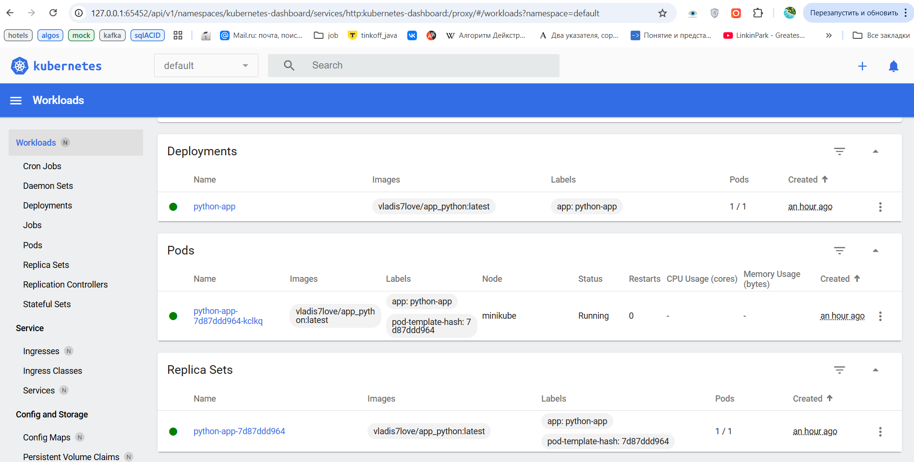
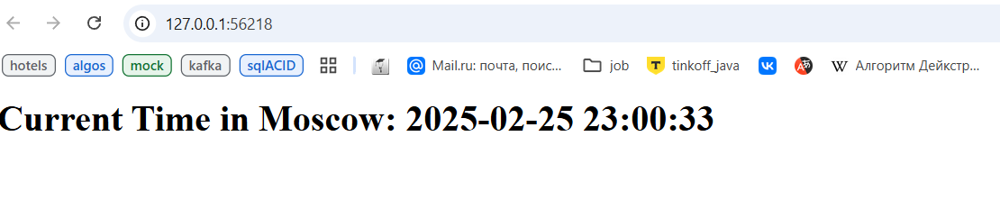
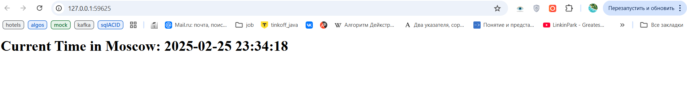
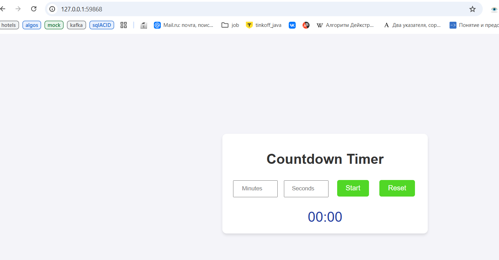

# **Kubernetes**

## Task 1: Kubernetes Setup and Basic Deployment

Here we can see the commands in order to deploy our python app:

### **📌 Set cluster entities:**

```bash
S25-core-course-labs\k8s> kubectl create deployment --image vladis7love/app_python:latest python-app --port 5000
S25-core-course-labs\k8s> kubectl expose deployment python-app --type=LoadBalancer --port=5000
```

### **📋 Output:**

```shell
deployment.apps/python-app created
service/python-app exposed
```

### **📌 Get Pods:**

```bash
S25-core-course-labs\k8s> kubectl get pods
```

### **📋 Output:**

```bash
NAME                          READY   STATUS    RESTARTS   AGE
python-app-7d87ddd964-kclkq   1/1     Running   0          62m
```

### **📌 Get Services:**

```bash
S25-core-course-labs\k8s> kubectl get svc 
```

### **📋 Output:**

```bash
NAME         TYPE           CLUSTER-IP       EXTERNAL-IP   PORT(S)          AGE
kubernetes   ClusterIP      10.96.0.1        <none>        443/TCP          14h
python-app   LoadBalancer   10.100.217.181   <pending>     5000:30619/TCP   25s
```

### **📌 Get Deployments:**

```bash
S25-core-course-labs\k8s> kubectl get deployments 
```

### **📋 Output:**

```bash
NAME         READY   UP-TO-DATE   AVAILABLE   AGE
python-app   1/1     1            1           63m
```




### **📌 Remove entities:**

```bash
S25-core-course-labs\k8s> kubectl delete service python-app
S25-core-course-labs\k8s> kubectl delete service python-app
```

### **📋 Output:**

```bash
service "python-app" deleted
deployment.apps "python-app" deleted
```

## Task 2: Declarative Kubernetes Manifests

In this task, I created a `Deployment` and `Service` with manifest files:

```bash
PS C:\Users\Vladi\PycharmProjects\S25-core-course-labs\k8s> kubectl apply -f python-app-deployment.yml                                            
deployment.apps/python-app-moscow-time created
PS C:\Users\Vladi\PycharmProjects\S25-core-course-labs\k8s> kubectl apply -f python-app-service.yml   
service/python-app-moscow-time-service created

PS C:\Users\Vladi\PycharmProjects\S25-core-course-labs\k8s> kubectl get pods,svc
NAME                                          READY   STATUS    RESTARTS   AGE
pod/python-app-moscow-time-78f6f94479-8qm8p   1/1     Running   0          21s
pod/python-app-moscow-time-78f6f94479-sxf7g   1/1     Running   0          21s
pod/python-app-moscow-time-78f6f94479-zz7qq   1/1     Running   0          21s

NAME                                     TYPE        CLUSTER-IP       EXTERNAL-IP   PORT(S)          AGE
service/kubernetes                       ClusterIP   10.96.0.1        <none>        443/TCP          14h
service/python-app-moscow-time-service   NodePort    10.105.106.238   <none>        5000:31269/TCP   12s
```

```bash
PS C:\Users\Vladi> minikube service --all
|-----------|------------|-------------|--------------|
| NAMESPACE |    NAME    | TARGET PORT |     URL      |
|-----------|------------|-------------|--------------|
| default   | kubernetes |             | No node port |
|-----------|------------|-------------|--------------|
😿  service default/kubernetes has no node port
|-----------|--------------------------------|-------------|---------------------------|
| NAMESPACE |              NAME              | TARGET PORT |            URL            |
|-----------|--------------------------------|-------------|---------------------------|
| default   | python-app-moscow-time-service |        5000 | http://192.168.49.2:31269 |
|-----------|--------------------------------|-------------|---------------------------|
❗  Services [default/kubernetes] have type "ClusterIP" not meant to be exposed, however for local development minikube allows you to access this !
🏃  Starting tunnel for service kubernetes.
🏃  Starting tunnel for service python-app-moscow-time-service.
|-----------|--------------------------------|-------------|------------------------|
| NAMESPACE |              NAME              | TARGET PORT |          URL           |
|-----------|--------------------------------|-------------|------------------------|
| default   | kubernetes                     |             | http://127.0.0.1:59623 |
| default   | python-app-moscow-time-service |             | http://127.0.0.1:59625 |
|-----------|--------------------------------|-------------|------------------------|
🎉  Opening service default/kubernetes in default browser...
🎉  Opening service default/python-app-moscow-time-service in default browser...
❗  Because you are using a Docker driver on windows, the terminal needs to be open to run it.
```

And open <http://192.168.49.2:31269>:


## Bonus Task: Additional Configuration and Ingress

### JS second app config result

```shell
PS C:\Users\Vladi\PycharmProjects\S25-core-course-labs\k8s> kubectl apply -f .\js-app-deployment.yml
deployment.apps/js-app-cnt created
PS C:\Users\Vladi\PycharmProjects\S25-core-course-labs\k8s> kubectl apply -f .\js-app-service.yml   
service/js-app-cnt-service created

PS C:\Users\Vladi\PycharmProjects\S25-core-course-labs\k8s> kubectl get pods,svc                   
NAME                                          READY   STATUS    RESTARTS   AGE
pod/js-app-cnt-67bb5bdc5b-cdlpj               1/1     Running   0          2m51s
pod/js-app-cnt-67bb5bdc5b-k7mqs               1/1     Running   0          2m51s
pod/js-app-cnt-67bb5bdc5b-p28zm               1/1     Running   0          2m51s        2m17s

NAME                                     TYPE        CLUSTER-IP      EXTERNAL-IP   PORT(S)          AGE
service/js-app-cnt-service               NodePort    10.103.198.13   <none>        8080:31830/TCP   2m42s
service/kubernetes                       ClusterIP   10.96.0.1       <none>        443/TCP          15h
```

```bash
PS C:\Users\Vladi> minikube service --all
|-----------|--------------------|-------------|---------------------------|
| NAMESPACE |        NAME        | TARGET PORT |            URL            |
|-----------|--------------------|-------------|---------------------------|
| default   | js-app-cnt-service |        8080 | http://192.168.49.2:31830 |
|-----------|--------------------|-------------|---------------------------|
|-----------|------------|-------------|--------------|
| NAMESPACE |    NAME    | TARGET PORT |     URL      |
|-----------|------------|-------------|--------------|
| default   | kubernetes |             | No node port |
|-----------|------------|-------------|--------------|
😿  service default/kubernetes has no node port
❗  Services [default/kubernetes] have type "ClusterIP" not meant to be exposed, however for local development minikube allows you to access this !
🏃  Starting tunnel for service js-app-cnt-service.
🏃  Starting tunnel for service kubernetes.
|-----------|--------------------------------|-------------|------------------------|
| NAMESPACE |              NAME              | TARGET PORT |          URL           |
|-----------|--------------------------------|-------------|------------------------|
| default   | js-app-cnt-service             |             | http://127.0.0.1:59868 |
| default   | kubernetes                     |             | http://127.0.0.1:59870 |
|-----------|--------------------------------|-------------|------------------------|
🎉  Opening service default/js-app-cnt-service in default browser...
🎉  Opening service default/kubernetes in default browser...
🎉  Opening service default/python-app-moscow-time-service in default browser...
❗  Because you are using a Docker driver on windows, the terminal needs to be open to run it.
```

And open <http://127.0.0.1:59868>:


### Ingress Nginx

```bash
> kubectl apply -f ingress.yml
ingress.networking.k8s.io/main-ingress created

> kubectl get ingress
NAME           CLASS   HOSTS                                               ADDRESS         PORTS   AGE
main-ingress   nginx   python-app-moscow-time.example,js-app-cnt.example   192.168.49.2    80      11m

> minikube ip
192.168.49.2

> minikube tunnel
✅  Tunnel successfully started
...
🏃  Starting tunnel for service main-ingress.
```

Let's check:

**Python:**

```bash
PS C:\Users\Vladi\PycharmProjects\S25-core-course-labs\k8s> curl.exe --resolve "python-app-moscow-time.example:80:127.0.0.1" -i http://python-app-moscow-time.example
HTTP/1.1 200 OK
Date: Tue, 25 Feb 2025 21:32:49 GMT
Content-Type: text/html; charset=utf-8
Content-Length: 52
Connection: keep-alive

<h1>Current Time in Moscow: 2025-02-26 00:32:49</h1>
```

**JS:**

```shell
PS C:\Users\Vladi\PycharmProjects\S25-core-course-labs\k8s> curl.exe --resolve "js-app-cnt.example:80:127.0.0.1" -i http://js-app-cnt.example                        
HTTP/1.1 200 OK
Date: Tue, 25 Feb 2025 21:33:17 GMT
Content-Type: text/html; charset=UTF-8
Content-Length: 620
Connection: keep-alive
X-Powered-By: Express
Accept-Ranges: bytes
Cache-Control: public, max-age=0
Last-Modified: Mon, 17 Feb 2025 19:46:25 GMT
ETag: W/"26c-19515729268"

<!DOCTYPE html>
<html lang="en">
<head>
  <meta charset="UTF-8">
  <meta name="viewport" content="width=device-width, initial-scale=1.0">
  <title>Countdown Timer</title>
  <link rel="stylesheet" href="style.css">
</head>
<body>
  <div class="container">
    <h1>Countdown Timer</h1>
    <input type="number" id="minutes" placeholder="Minutes" min="0">
    <input type="number" id="seconds" placeholder="Seconds" min="0" max="59">
    <button id="start">Start</button>
    <button id="reset">Reset</button>
    <div id="timer">00:00</div>
  </div>
  <script src="script.js"></script>
</body>
</html>
```
