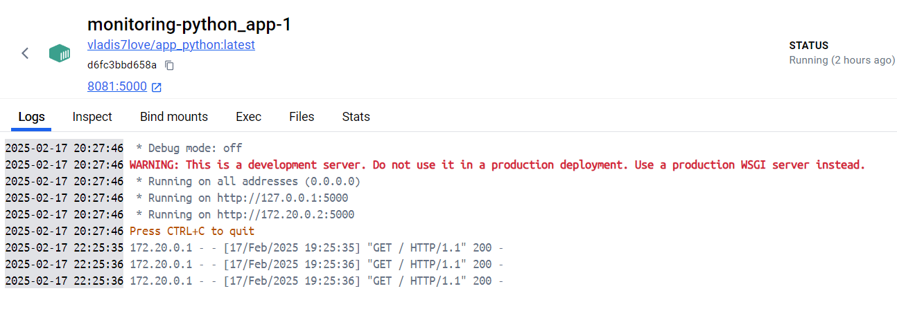

# Monitoring and Logging

This lab introduces a logging stack using **Promtail**,
**Loki**, and **Grafana** to collect, store, and visualize logs from multiple applications. The setup is managed with Docker Compose to simplify deployment.

## Components

1. Loki - A log aggregation system designed to store and query logs efficiently.

2. Promtail - A lightweight agent that collects logs from running applications and forwards them to Loki.

3. Grafana - A visualization tool used to explore and analyze logs from Loki.
4. - Python app - A simple Python-based service generating logs.
   - JavaScript app - A web-based application also producing logs.

## Steps

- Applications running in containers generate logs, which are stored in Docker's log files.
- Promtail reads these log files, adds relevant labels, and forwards them to Loki.
- Loki ingests the logs and stores them with their associated labels.
- We can explore `http://localhost:3000` and use query to process logs.

## Screenshots

### All logs

### Python App

**Container logs:**

**Grafana logs:**

### JS App

**Container logs:**

**Grafana logs:**

