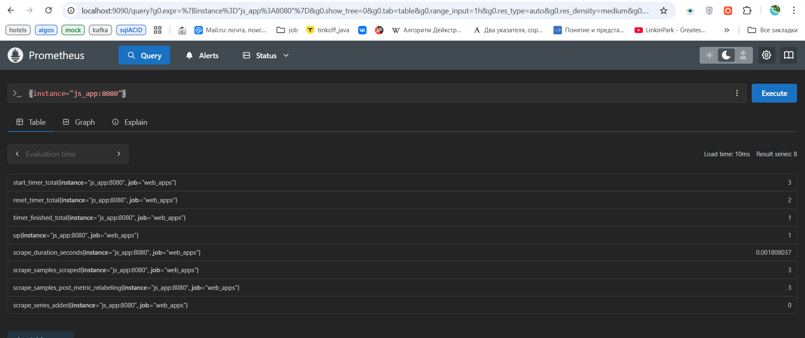

# MONITORING & METRICS

## Task 1

### Steps

- Added Prometheus as a service in the docker-compose.yml file.

- Configured memory constraints, enabled log rotation, and implemented health checks.

- Set up Prometheus to collect metrics from other components, including loki, python_app, and js_app.

- Defined scraping targets in prometheus.yml to monitor:
    - The Prometheus server itself (`prometheus:9090`)
    - Grafana (`grafana:3000`)
    - Loki (`loki:3100`)
    - Web applications (`python_app:5000`, `js_app:8080`)

- Verifying Prometheus Targets
    - Navigated to <http://localhost:9090/targets> to ensure all configured targets were reachable and actively being
      scraped.

### Screenshots

#### All metrics


#### Loki


#### Grafana


#### Python App


#### JS App



## Task 2: Dashboard and Configuration Enhancements

### Grafana Dashboards

To improve monitoring visibility, these dashboards for both Loki and Prometheus, which
provide valuable insights into system performance and logs.

- **Loki Dashboard**: Utilized a pre-configured dashboard template for visualizing application logs.

- **Prometheus Dashboard**: Leveraged an example dashboard to visualize and track key performance metrics from the
  applications, ensuring smooth operation and fast issue identification.

### Screenshots

#### Loki Dashboard


This dashboard provides a detailed view of logs, helping monitor application events and troubleshoot issues effectively.

#### Prometheus Dashboard


This dashboard offers a comprehensive overview of system performance metrics, such as HTTP request counts and service
response times.

### Service Configuration Updates

To optimize the containerized environment, I made several key updates to the `docker-compose.yml` file, including
enhanced logging and resource management:

- **Log Rotation Mechanisms**: Configured the `json-file` logging driver with `max-size: 10m` and `max-file: 2` for all
  services. This ensures efficient log management by rotating logs and preventing them from consuming excessive disk
  space.

- **Memory Limits**: Specified memory limits for each container to ensure optimal resource usage and avoid
  over-allocation. For example:
    - `memory: 50M` for Prometheus.
    - `memory: 200M` for Loki.
  
  These memory restrictions help prevent any single container from consuming too much memory, thereby ensuring
  system stability.

### Metrics Gathering

Prometheus metrics collection was extended to cover all relevant services:

- **New `web_apps` Job**: I added a `prometheus`, `loki`, `grafana`, `web_apps` jobs in the `prometheus.yml` configuration to scrape and collect metrics
  from the newly added monitoring apps, `python_app` and `js_app` services.

This setup ensures that Prometheus collects a broad range of metrics across all services, contributing to a more
comprehensive monitoring solution.

---

## Bonus Task: Metrics and Health Checks

### Application Metrics Integration

#### Python Application (`app_python`)

- **Prometheus Metrics**: A `Counter` metric (`http_requests_total`) was added to track the total number of HTTP
  requests.
- **Current Time Endpoint**: A `/` route was created to display the current time in Moscow, updated every time a request
  is made.
- **Metrics Endpoint**: The `/metrics` route exposes the metrics in Prometheus-compatible format, generated
  using `prometheus_client`.

```python
from prometheus_client import Counter, generate_latest, CONTENT_TYPE_LATEST

REQUEST_COUNT = Counter("http_requests_total", "Total number of HTTP requests")
```

#### JavaScript Application (`app_js`)

- **Custom Metrics**: Metrics for `start_timer`, `reset_timer`, and `timer_finished` were created using a custom object.
  These metrics are incremented through POST requests to the `/metrics` endpoint.
- **Metrics Endpoint**: The `/metrics` route exposes the current values of the metrics in a Prometheus-compatible text
  format.

```javascript
app.get("/metrics", (req, res) => {
    const metricText = `# HELP start_timer_total Total count of start timer events\n# TYPE start_timer_total counter\nstart_timer_total ${metrics.start_timer}\n` +
        `# HELP reset_timer_total Total count of reset timer events\n# TYPE reset_timer_total counter\nreset_timer_total ${metrics.reset_timer}\n` +
        `# HELP timer_finished_total Total count of finished timer events\n# TYPE timer_finished_total counter\ntimer_finished_total ${metrics.timer_finished}\n`;
    res.set('Content-Type', 'text/plain');
    res.send(metricText);
});
```

### Application Metrics & Screenshots

I configured applications to export metrics:

1. Python app exposes metrics at `http://localhost:8081/metrics`.


2. JS app exposes metrics at `http://localhost:8082/metrics`.


### Health Checks

Health checks were added to the containers for each service to ensure they are running properly.

- For `prometheus`, `loki`, and `grafana`, health checks were set up using `pgrep` to verify that the corresponding processes
  are running.
- For the `Python` and `JS` applications, health checks are based on `curl requests` to ensure their respective endpoints /metrics are accessible.

Prometheus part example:

```yml
    healthcheck:
      test: [ "CMD", "pgrep", "prometheus" ]
      start_period: 5s
      retries: 3
      timeout: 5s
```

JS part example:

```yml
    healthcheck:
      test: "curl -f http://localhost:8080 || exit 1"
      retries: 3
      start_period: 5s
      timeout: 5s
```
