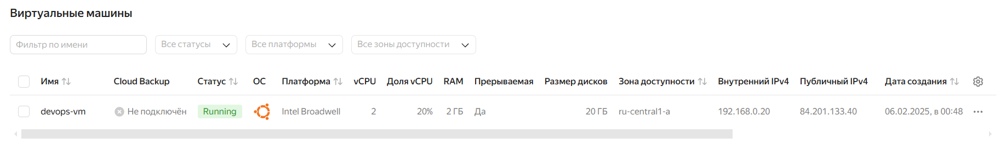
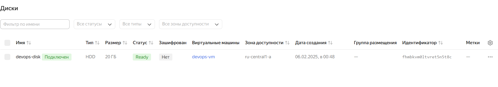
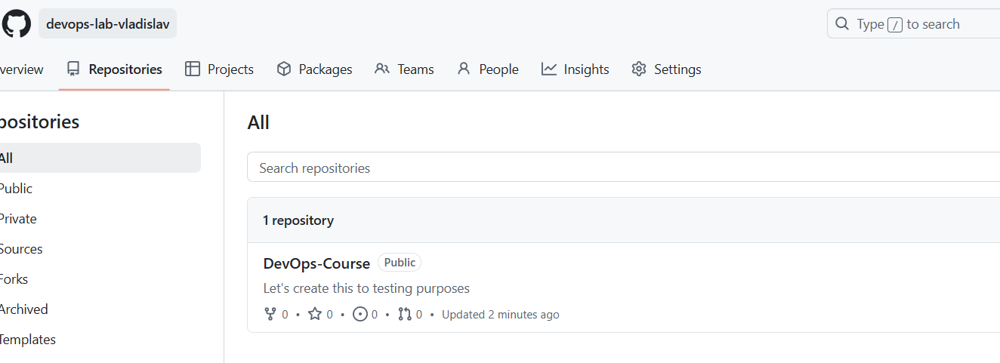

# **Terraform**

## ✅ Best Practices

- I **use variables** instead of hardcoded values to make configurations **flexible and reusable**.

```hcl
variable "js_container_name" {
  description = "Name for the JavaScript application container"
  type        = string
  default     = "countdown-timer"
}
```

- Also, separate configurations into different files to maintain clarity and modularity
- Always check for syntax errors and logical mistakes before deploying.

```hcl
\S25-core-course-labs\terraform\docker> terraform validate
Success! The configuration is valid.
```

- Define output values to retrieve important resource information.

## **🔹 Commands Outputs:**

### **📌 Command:**

```bash
> terraform state show docker_container.moscow_time_app
```

### **📋 Output:**

```bash
# docker_container.moscow_time_app:
resource "docker_container" "moscow_time_app" {
    attach                                      = false
    bridge                                      = null
    command                                     = [
        "python",
        "-m",
        "flask",
        "run",
        "--host",
        "0.0.0.0",
    ]
    container_read_refresh_timeout_milliseconds = 15000
    cpu_set                                     = null
    cpu_shares                                  = 0
    domainname                                  = null
    entrypoint                                  = []
    env                                         = []
    hostname                                    = "786a44ed6665"
    id                                          = "786a44ed66655dd27cb164a97c4b8bb1983373b05c2783e70c2139dc45a81403"
    image                                       = "sha256:8078b83bff505c81d0439f46420afa252fdaf22a8f869e93d46113b25b78ba01"
    init                                        = false
    ipc_mode                                    = "private"
    log_driver                                  = "json-file"
    logs                                        = false
    max_retry_count                             = 0
    memory                                      = 0
    memory_swap                                 = 0
    must_run                                    = true
    name                                        = "moscow-time-app"
    network_data                                = [
        {
            gateway                   = "172.17.0.1"
            global_ipv6_address       = null
            global_ipv6_prefix_length = 0
            ip_address                = "172.17.0.3"
            ip_prefix_length          = 16
            ipv6_gateway              = null
            mac_address               = "02:42:ac:11:00:03"
            network_name              = "bridge"
        },
    ]
    network_mode                                = "bridge"
    pid_mode                                    = null
    privileged                                  = false
    publish_all_ports                           = false
    read_only                                   = false
    remove_volumes                              = true
    restart                                     = "no"
    rm                                          = false
    runtime                                     = "runc"
    security_opts                               = []
    shm_size                                    = 64
    start                                       = true
    stdin_open                                  = false
    stop_signal                                 = null
    stop_timeout                                = 0
    tty                                         = false
    user                                        = "appuser"
    userns_mode                                 = null
    wait                                        = false
    wait_timeout                                = 60
    working_dir                                 = "/app"

    ports {
        external = 5000
        internal = 5000
        ip       = "0.0.0.0"
        protocol = "tcp"
    }
}
```

### **📌 Command:**

```bash
> terraform state show docker_container.countdown_timer_app
```

### **📋 Output:**

```bash
# docker_container.countdown_timer_app:
resource "docker_container" "countdown_timer_app" {
    attach                                      = false
    bridge                                      = null
    command                                     = [
        "http-server",
        "-p",
        "8080",
    ]
    container_read_refresh_timeout_milliseconds = 15000
    cpu_set                                     = null
    cpu_shares                                  = 0
    domainname                                  = null
    entrypoint                                  = [
        "docker-entrypoint.sh",
    ]
    env                                         = []
    hostname                                    = "84d3ebde3094"
    id                                          = "84d3ebde30946b9917dbcbcb11246f41bddd324ae258ac3906ca57332d774e9d"
    image                                       = "sha256:49ee49268bd89d6cd69f8beb8354ab6c90dfcdb6dff93bc6dbfa25fde641718b"
    init                                        = false
    ipc_mode                                    = "private"
    log_driver                                  = "json-file"
    logs                                        = false
    max_retry_count                             = 0
    memory                                      = 0
    memory_swap                                 = 0
    must_run                                    = true
    name                                        = "countdown-timer"
    network_data                                = [
        {
            gateway                   = "172.17.0.1"
            global_ipv6_address       = null
            global_ipv6_prefix_length = 0
            ip_address                = "172.17.0.2"
            ip_prefix_length          = 16
            ipv6_gateway              = null
            mac_address               = "02:42:ac:11:00:02"
            network_name              = "bridge"
        },
    ]
    network_mode                                = "bridge"
    pid_mode                                    = null
    privileged                                  = false
    publish_all_ports                           = false
    read_only                                   = false
    remove_volumes                              = true
    restart                                     = "no"
    rm                                          = false
    runtime                                     = "runc"
    security_opts                               = []
    shm_size                                    = 64
    start                                       = true
    stdin_open                                  = false
    stop_signal                                 = null
    stop_timeout                                = 0
    tty                                         = false
    user                                        = "appuser"
    userns_mode                                 = null
    wait                                        = false
    wait_timeout                                = 60
    working_dir                                 = "/usr/share/app"

    ports {
        external = 8080
        internal = 8080
        ip       = "0.0.0.0"
        protocol = "tcp"
    }
}
```

### **📌 Command:**

```bash
> terraform state list
```

### **📋 Output:**

```bash
docker_container.countdown_timer_app
docker_container.moscow_time_app
docker_image.js_app
docker_image.python_app
```

### **📌 Command:**

```bash
> terraform apply
```

### **📋 Output:**

```bash
Terraform used the selected providers to generate the following execution plan.
Resource actions are indicated with the following symbols:
  + create

Terraform will perform the following actions:

  # docker_container.countdown_timer_app will be created
  + resource "docker_container" "countdown_timer_app" {
      + attach                                      = false
      + bridge                                      = (known after apply)
      + command                                     = (known after apply)
      + container_logs                              = (known after apply)
      + container_read_refresh_timeout_milliseconds = 15000
      + entrypoint                                  = (known after apply)
      + env                                         = (known after apply)
      + exit_code                                   = (known after apply)
      + hostname                                    = (known after apply)
      + id                                          = (known after apply)
      + image                                       = "vladis7love/app_javascript:latest"
      + init                                        = (known after apply)
      + ipc_mode                                    = (known after apply)
      + wait_timeout                                = 60

      + healthcheck (known after apply)

      + labels (known after apply)

      + ports {
          + external = 8080
          + internal = 8080
          + ip       = "0.0.0.0"
          + protocol = "tcp"
        }
    }

  # docker_container.moscow_time_app will be created
  + resource "docker_container" "moscow_time_app" {
      + attach                                      = false
...
      + labels (known after apply)

      + ports {
          + external = 5000
          + internal = 5000
          + ip       = "0.0.0.0"
          + protocol = "tcp"
        }
    }

  # docker_image.js_app will be created
  + resource "docker_image" "js_app" {
      + id          = (known after apply)
      + image_id    = (known after apply)
      + name        = "vladis7love/app_javascript:latest"
      + repo_digest = (known after apply)
    }

  # docker_image.python_app will be created
  + resource "docker_image" "python_app" {
      + id          = (known after apply)
      + image_id    = (known after apply)
      + name        = "vladis7love/app_python:latest"
      + repo_digest = (known after apply)
    }

Plan: 4 to add, 0 to change, 0 to destroy.

Changes to Outputs:
  + js_container_id     = (known after apply)
  + js_container_ip     = (known after apply)
  + python_container_id = (known after apply)
  + python_container_ip = (known after apply)
docker_image.python_app: Creating...
docker_image.js_app: Creating...
...
```

### **📌 Command:**

```bash
> terraform output
```

### **📋 Output:**

```bash
js_container_id = "84d3ebde30946b9917dbcbcb11246f41bddd324ae258ac3906ca57332d774e9d"
js_container_ip = "172.17.0.2"
python_container_id = "786a44ed66655dd27cb164a97c4b8bb1983373b05c2783e70c2139dc45a81403"
python_container_ip = "172.17.0.3"
```

## Yandex Cloud

This Terraform configuration sets up a cloud infrastructure on Yandex Cloud, consisting of:

- A Virtual Private Cloud (VPC) – to create an isolated network.
- A Subnet – to define IP ranges within the VPC.
- A Persistent Disk – for VM storage with a specified image (Ubuntu).
- A Compute Instance (VM) – a virtual machine with specified CPU, memory, and SSH access.
- Network Configuration – The VM is assigned both internal and external IP addresses with NAT enabled.




### **📌 Command:**

```bash
> terraform apply
```

### **📋 Output:**

```bash
Terraform used the selected providers to generate the following execution
plan. Resource actions are indicated with the following symbols:
  + create

Terraform will perform the following actions:

  # yandex_compute_disk.vm-disk will be created
  + resource "yandex_compute_disk" "vm-disk" {
      + block_size  = 4096
      + created_at  = (known after apply)
      + folder_id   = (known after apply)
      + id          = (known after apply)
      + image_id    = "fd859s00ru90mn31cjf4"
      + name        = "devops-disk"
      + product_ids = (known after apply)
      + size        = 20
      + status      = (known after apply)
      + type        = "network-hdd"
      + zone        = "ru-central1-a"

      + disk_placement_policy (known after apply)

      + hardware_generation (known after apply)
    }

  # yandex_compute_instance.vm will be created
  + resource "yandex_compute_instance" "vm" {
      + created_at                = (known after apply)
      + folder_id                 = (known after apply)
      + fqdn                      = (known after apply)
...
        }

      + placement_policy (known after apply)

      + resources {
          + core_fraction = 20
          + cores         = 2
          + memory        = 2
        }

      + scheduling_policy {
          + preemptible = true
        }
    }

  # yandex_vpc_network.devops-net will be created
  + resource "yandex_vpc_network" "devops-net" {
      + created_at                = (known after apply)
      + default_security_group_id = (known after apply)
      + folder_id                 = (known after apply)
      + id                        = (known after apply)
      + labels                    = (known after apply)
      + name                      = "devops-network"
      + subnet_ids                = (known after apply)
    }

  # yandex_vpc_subnet.devops-subnet will be created
  + resource "yandex_vpc_subnet" "devops-subnet" {
      + created_at     = (known after apply)
      + folder_id      = (known after apply)
      + id             = (known after apply)
      + labels         = (known after apply)
      + name           = (known after apply)
      + network_id     = (known after apply)
      + v4_cidr_blocks = [
          + "192.168.0.0/16",
        ]
      + v6_cidr_blocks = (known after apply)
      + zone           = "ru-central1-a"
    }

Plan: 4 to add, 0 to change, 0 to destroy.

Changes to Outputs:
  + vm_external_ip = (known after apply)
  + vm_id          = (known after apply)
  + vm_internal_ip = (known after apply)
yandex_vpc_network.devops-net: Creating...
yandex_compute_disk.vm-disk: Creating...
yandex_vpc_network.devops-net: Creation complete after 2s [id=enpe0jh7vj6k9rqop028]
...
Apply complete! Resources: 4 added, 0 changed, 0 destroyed.
```

### **📌 Command:**

```bash
> terraform output
```

### **📋 Output:**

```bash
vm_external_ip = "84.201.133.40"
vm_id = "fhm7p44s09ksonkmg1n5"
vm_internal_ip = "192.168.0.20"
```

So, we can connect ssh:

```bash
> ssh ubuntu@84.201.133.40

ubuntu@fhm7p44s09ksonkmg1n5:~$
```

## GitHub

### **📌 Command:**

```bash
> terraform apply
```

### **📋 Output:**

```bash
github_repository.repo: Refreshing state... [id=S25-core-course-labs]

Terraform used the selected providers to generate the following execution
plan. Resource actions are indicated with the following symbols:
  + create
  ~ update in-place

Terraform will perform the following actions:

  # github_branch_default.master will be created
  + resource "github_branch_default" "master" {
      + branch     = "master"
      + id         = (known after apply)
      + repository = "S25-core-course-labs"
    }

  # github_branch_protection.default will be created
  + resource "github_branch_protection" "default" {
      + allows_deletions                = false
      + allows_force_pushes             = false
      + blocks_creations                = false
      + enforce_admins                  = true
      + id                              = (known after apply)
      + pattern                         = "master"
      + repository_id                   = "S25-core-course-labs"
      + require_conversation_resolution = true
      + require_signed_commits          = false
      + required_linear_history         = false

      + required_pull_request_reviews {
          + required_approving_review_count = 1
        }
    }

  # github_repository.repo will be updated in-place
  ~ resource "github_repository" "repo" {
      ~ auto_init                   = false -> true
      ~ description                 = "Innopolis DevOps course" -> "DevOps Labs repo"
      - has_downloads               = true -> null
      ~ has_issues                  = false -> true
      - has_projects                = true -> null
        id                          = "S25-core-course-labs"
        name                        = "S25-core-course-labs"
        # (28 unchanged attributes hidden)
    }

Plan: 2 to add, 1 to change, 0 to destroy.

Do you want to perform these actions?
  Terraform will perform the actions described above.
  Only 'yes' will be accepted to approve.

  Enter a value: yes

github_repository.repo: Modifying... [id=S25-core-course-labs]
github_repository.repo: Modifications complete after 3s [id=S25-core-course-labs]
github_branch_default.master: Creating...
github_branch_default.master: Creation complete after 1s [id=S25-core-course-labs]
github_branch_protection.default: Creating...
github_branch_protection.default: Creation complete after 5s [id=BPR_kwDONvuV5c4Dif8l]

Apply complete! Resources: 2 added, 1 changed, 0 destroyed.
```

## GitHub Teams

```css
This Terraform configuration applied changes to the GitHub organization devops-lab-vladislav, including the creation
of a new repository (DevOps-Course), setting up branch protection rules, and defining three teams(Maintainers,
Contributors, and Readers) with different levels of access. The repository is public, initialized with a README,
and has issues tracking enabled. The default branch is main, with mandatory pull request reviews and admin protection.
Teams were assigned appropriate permissions, ensuring structured collaboration and security within the organization.
```



- Teams (Maintainers, Contributors, Readers) are assigned only the necessary permissions, ensuring secure access
  control.
- The main branch is protected with enforced pull request reviews and admin restrictions to maintain code integrity.
- Variables (github_token, github_organization) keep the configuration flexible, avoiding hardcoded credentials or
  organization details.
- Sensitive data like tokens are stored as environment variables, preventing accidental exposure.
- The repository settings, access controls, and security policies are declaratively managed with Terraform, enabling
  traceable and reproducible changes.

### **📌 Command:**

```bash
> terraform apply
```

### **📋 Output:**

```bash
Terraform used the selected providers to generate the following execution
plan. Resource actions are indicated with the following symbols:
  + create

Terraform will perform the following actions:

  # github_branch_default.main_branch will be created
  + resource "github_branch_default" "main_branch" {
      + branch     = "main"
      + id         = (known after apply)
      + repository = "DevOps-Course"
    }

  # github_branch_protection.repo_protection will be created
  + resource "github_branch_protection" "repo_protection" {
      + allows_deletions                = false
      + allows_force_pushes             = false
      + blocks_creations                = false
      + enforce_admins                  = true
      + id                              = (known after apply)
      + pattern                         = "main"
      + repository_id                   = (known after apply)
      + require_conversation_resolution = true
      + require_signed_commits          = false
      + required_linear_history         = false

      + required_pull_request_reviews {
          + required_approving_review_count = 3
        }

      + required_status_checks {
          + contexts = [
              + "CI/CD Pipeline",
              + "Linting",
              + "Tests",
            ]
          + strict   = true
        }
    }

  # github_repository.repository will be created
  + resource "github_repository" "repository" {
      + allow_auto_merge            = true
      + allow_merge_commit          = true
      + allow_rebase_merge          = true
      + allow_squash_merge          = true
      + archived                    = false
      + auto_init                   = true
      + branches                    = (known after apply)
      + default_branch              = (known after apply)
      + delete_branch_on_merge      = true
      + description                 = "Let's create this to testing purposes"
      + etag                        = (known after apply)
      + full_name                   = (known after apply)
      + git_clone_url               = (known after apply)
      + has_issues                  = true
      + has_wiki                    = false
      + html_url                    = (known after apply)
      + http_clone_url              = (known after apply)
      + id                          = (known after apply)
      + merge_commit_message        = "PR_TITLE"
      + merge_commit_title          = "MERGE_MESSAGE"
      + name                        = "DevOps-Course"
      + node_id                     = (known after apply)
      + private                     = (known after apply)
      + repo_id                     = (known after apply)
      + squash_merge_commit_message = "COMMIT_MESSAGES"
      + squash_merge_commit_title   = "COMMIT_OR_PR_TITLE"
      + ssh_clone_url               = (known after apply)
      + svn_url                     = (known after apply)
      + visibility                  = "public"
    }

  # github_team.contributors will be created
  + resource "github_team" "contributors" {
      + create_default_maintainer = false
      + description               = "Contributors from open-source"
      + etag                      = (known after apply)
      + id                        = (known after apply)
      + members_count             = (known after apply)
      + name                      = "Repository Contributors"
      + node_id                   = (known after apply)
      + privacy                   = "closed"
      + slug                      = (known after apply)
    }

  # github_team.maintainers will be created
  + resource "github_team" "maintainers" {
      + create_default_maintainer = false
      + description               = "Stakeholders"
      + etag                      = (known after apply)
      + id                        = (known after apply)
      + members_count             = (known after apply)
      + name                      = "Repository Maintainers"
      + node_id                   = (known after apply)
      + privacy                   = "closed"
      + slug                      = (known after apply)
    }

  # github_team_repository.contributors will be created
  + resource "github_team_repository" "contributors" {
      + etag       = (known after apply)
      + id         = (known after apply)
      + permission = "push"
      + repository = "DevOps-Course"
      + team_id    = (known after apply)
    }

  # github_team_repository.maintainers will be created
  + resource "github_team_repository" "maintainers" {
      + etag       = (known after apply)
      + id         = (known after apply)
      + permission = "maintain"
      + repository = "DevOps-Course"
      + team_id    = (known after apply)
    }

Plan: 7 to add, 0 to change, 0 to destroy.

Do you want to perform these actions?
  Terraform will perform the actions described above.
  Only 'yes' will be accepted to approve.

  Enter a value: yes

github_team.maintainers: Creating...
github_team.contributors: Creating...
github_repository.repository: Creating...
github_team.contributors: Still creating... [10s elapsed]
github_team.maintainers: Still creating... [10s elapsed]
github_repository.repository: Still creating... [10s elapsed]
github_team.contributors: Creation complete after 14s [id=12124270]
github_team.maintainers: Creation complete after 14s [id=12124271]
github_repository.repository: Creation complete after 15s [id=DevOps-Course]
github_team_repository.maintainers: Creating...
github_branch_default.main_branch: Creating...
github_team_repository.contributors: Creating...
github_branch_default.main_branch: Creation complete after 5s [id=DevOps-Course]
github_branch_protection.repo_protection: Creating...
github_team_repository.contributors: Creation complete after 5s [id=12124270:DevOps-Course]
github_team_repository.maintainers: Creation complete after 5s [id=12124271:DevOps-Course]
github_branch_protection.repo_protection: Creation complete after 5s [id=BPR_kwDON1BjzM4DigDX]

Apply complete! Resources: 7 added, 0 changed, 0 destroyed.
```
